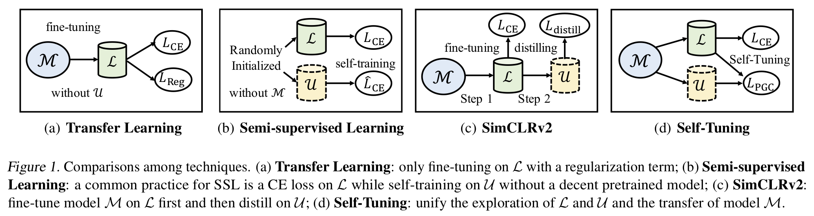

# Self-Tuning for Data-Efficient Deep Learning

This repository contains the implementation code for paper: <br>
__Self-Tuning for Data-Efficient Deep Learning__ <br>
[Ximei Wang](https://wxm17.github.io/), [Jinghan Gao](https://github.com/getterk96), [Mingsheng Long](http://ise.thss.tsinghua.edu.cn/~mlong/), [Jianmin Wang](http://ise.thss.tsinghua.edu.cn/~wangjianmin/)<br>
_38th International Conference on Machine Learning (ICML 2021)_ <br>
[[Project Page](http://github.com/thuml/Self-Tuning)] [[Paper](https://arxiv.org/abs/2102.12903)] [[Video](https://icml.cc/virtual/2021/spotlight/8616)] [[Slide](https://github.com/thuml/Self-Tuning/blob/master/Self-Tuning-Slide.pdf)] [[Poster](https://github.com/thuml/Self-Tuning/blob/master/Self-Tuning-Poster.png)] [[Blog](https://mp.weixin.qq.com/s/H4xlndTZtWuXHni-vOC_vQ)] [[Zhihu](https://zhuanlan.zhihu.com/p/393342161)] [[SlidesLive](https://recorder-v3.slideslive.com/#/share?share=40334&s=f7988e61-bece-4a7a-a6ba-3e1a2b49b37b)]

<p align="center">
     <br>
</p>


## Brief Introduction for Data-Efficient Deep Learning
Mitigating the requirement for labeled data is a vital issue in deep learning community. However, _common practices_ of TL and SSL only focus on either the pre-trained model or unlabeled data. This paper unleashes the power of both worlds by proposing _a new setup_ named data-efficient deep learning, aims to mitigate the requirement of labeled data by unifying the exploration of labeled and unlabeled data and the transfer of pre-trained model. 

To address the challenge of confirmation bias in self-training, a general _Pseudo Group Contrast_ mechanism is devised to mitigate the reliance on pseudo-labels and boost the tolerance to false labels. To tackle the model shift problem, we unify the exploration of labeled and unlabeled data and the transfer of a pre-trained model, with a shared key queue beyond just 'parallel training'. 
Comprehensive experiments demonstrate that Self-Tuning outperforms its SSL and TL counterparts on five tasks by sharp margins, _e.g._, it doubles the accuracy of fine-tuning on Stanford-Cars provided with 15% labels. 


## Dependencies
* python3.6
* torch == 1.3.1 (with suitable CUDA and CuDNN version)
* torchvision == 0.4.2
* tensorboardX
* numpy
* argparse

## Datasets
| Dataset | Download Link |
| -- | -- |
| CUB-200-2011 | http://www.vision.caltech.edu/visipedia/CUB-200-2011.html |
| Stanford Cars | http://ai.stanford.edu/~jkrause/cars/car_dataset.html |
| FGVC Aircraft | http://www.robots.ox.ac.uk/~vgg/data/fgvc-aircraft/ |
| Cifar100 | https://www.cs.toronto.edu/~kriz/cifar.html |

- You can either download datasets via the above links or directly run the commands shown below to automatically download datasets as well as data lists from Tsinghua Cloud.

## Disclaimer on Datasets

This open-sourced code will download and prepare public datasets. We do not host or distribute these datasets, vouch for their quality or fairness, or claim that you have licenses to use the dataset. It is your responsibility to determine whether you have permission to use the dataset under the dataset's license.

If you're a dataset owner and wish to update any part of it (description, citation, etc.), or do not want your dataset to be included in this code, please get in touch with us through a GitHub issue. Thanks for your contribution to the ML community!


## Quick Start
- The running commands for several datasets are shown below. Please refer to ``run.sh`` for commands for datasets with other label ratios.
```
python src/main.py  --root ./StanfordCars --batch_size 24 --logdir vis/ --gpu_id 0 --queue_size 32 --projector_dim 1024 --backbone resnet50  --label_ratio 15 --pretrained
python src/main.py  --root ./CUB200 --batch_size 24 --logdir vis/ --gpu_id 1 --queue_size 32 --projector_dim 1024 --backbone resnet50 --label_ratio 15 --pretrained
python src/main.py  --root ./Aircraft --batch_size 24 --logdir vis/ --gpu_id 2 --queue_size 32 --projector_dim 1024 --backbone resnet50 --label_ratio 15 --pretrained
python src/main.py  --root ./cifar100 --batch_size 20 --logdir vis/ --gpu_id 3 --queue_size 32 --backbone efficientnet-b2 --num_labeled 10000 --expand_label --pretrained --projector_dim 1024

```
## Tensorboard Log
| Dataset | Label Ratio 1 | Label Ratio 2 | Label Ratio 3 |
| -- | -- | -- | -- |
| CUB-200-2011 | [15%](http://github.com/thuml/Self-Tuning/blob/master/vis/CUB200_15.png) | [30%](http://github.com/thuml/Self-Tuning/blob/master/vis/CUB200_30.png) | [50%](http://github.com/thuml/Self-Tuning/blob/master/vis/CUB200_50.png) |
| Stanford Cars  | [15%](http://github.com/thuml/Self-Tuning/blob/master/vis/StanfordCars_15.png) | [30%](http://github.com/thuml/Self-Tuning/blob/master/vis/StanfordCars_30.png) | [50%](http://github.com/thuml/Self-Tuning/blob/master/vis/StanfordCars_50.png) |
| FGVC Aircraft  | [15%](http://github.com/thuml/Self-Tuning/blob/master/vis/Aircraft_15.png) | [30%](http://github.com/thuml/Self-Tuning/blob/master/vis/Aircraft_30.png) | [50%](http://github.com/thuml/Self-Tuning/blob/master/vis/Aircraft_50.png) |
| Cifar100  | [400](http://github.com/thuml/Self-Tuning/blob/master/vis/Cifar100_400.png) | [2500](http://github.com/thuml/Self-Tuning/blob/master/vis/Cifar100_2500.png) | [10000](http://github.com/thuml/Self-Tuning/blob/master/vis/Cifar100_10000.png) |

- We achieved better results than that reported in the paper, after fixing some small bugs of the code.


## Updates
- [07/2021] We have created a [Blog post](https://mp.weixin.qq.com/s/H4xlndTZtWuXHni-vOC_vQ) in Chinese for this work. Check it out for more details!
- [07/2021] We have released the code and models. You can find all reproduced checkpoints via [this link](https://cloud.tsinghua.edu.cn/d/4e8fb444c4634e76ab0a/).
- [06/2021] A five minute [video](https://icml.cc/virtual/2021/spotlight/8616) is released to briefly introduce the main idea of Self-Tuning. 
- [05/2021] Paper accepted to [ICML 2021](https://icml.cc/Conferences/2021/Schedule?type=Poster) as a __Short Talk__. 
- [02/2021] [arXiv version](https://arxiv.org/abs/2102.12903) posted. Please stay tuned for updates.


## Citation
If you find this code or idea useful, please cite our work:
```bib
@inproceedings{wang2021selftuning,
  title={Self-Tuning for Data-Efficient Deep Learning},
  author={Wang, Ximei and Gao, Jinghan and Long, Mingsheng and Wang, Jianmin},
  booktitle={International Conference on Machine Learning (ICML)},
  year={2021}
}
```


## Contact
If you have any questions, feel free to contact us through email (wxm17@mails.tsinghua.edu.cn) or Github issues. Enjoy!
